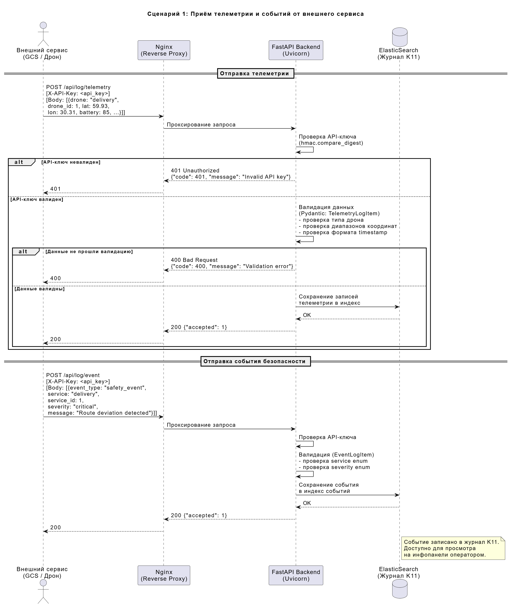
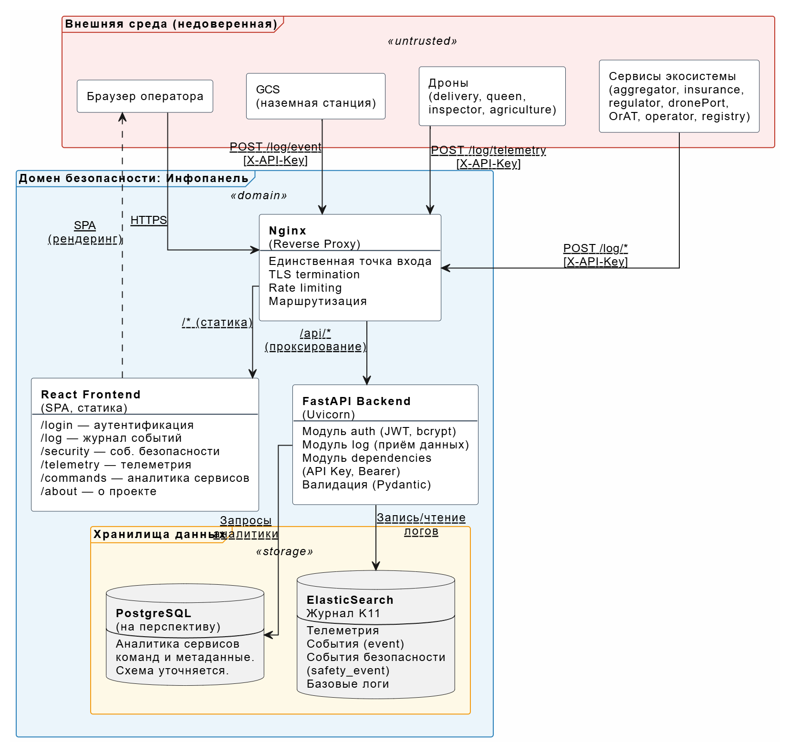
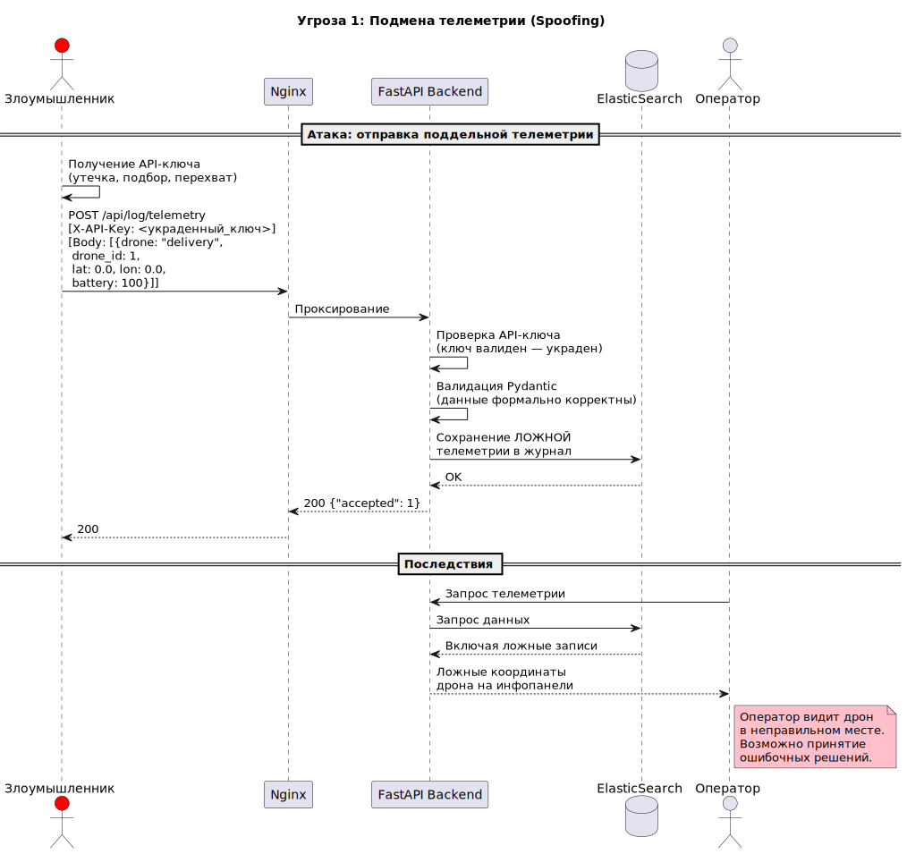
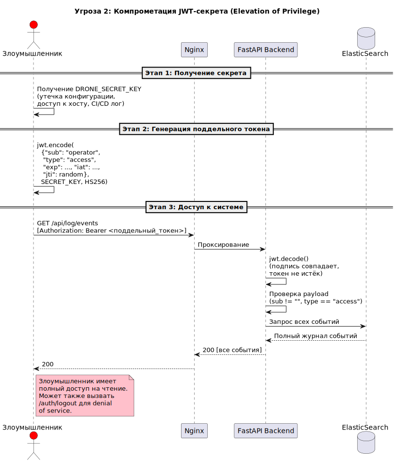
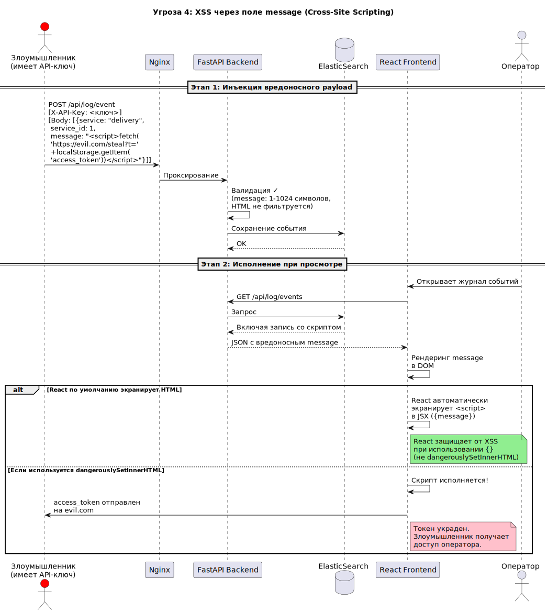
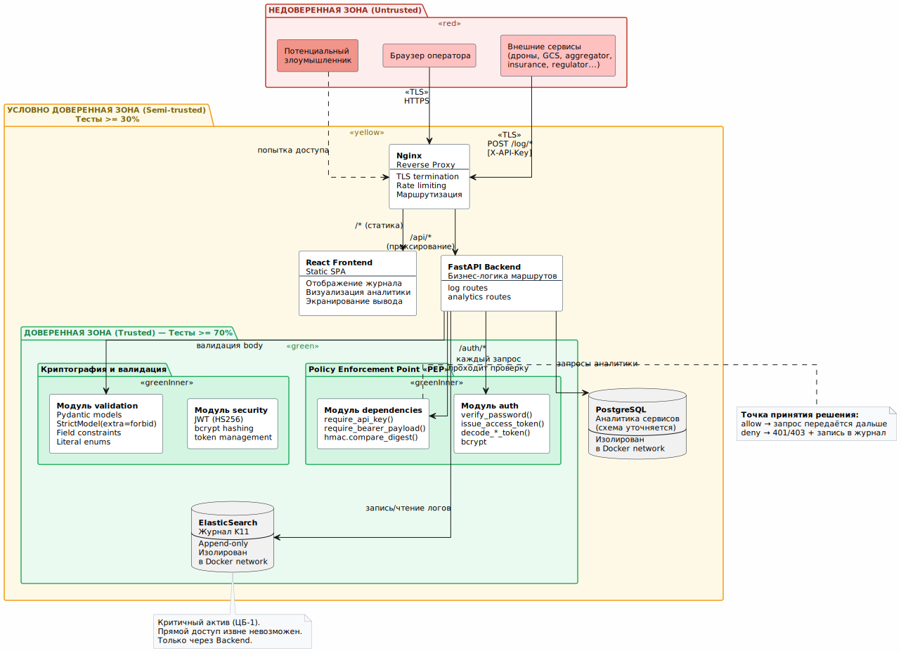

# Анализ безопасности системы DroneAnalytics (Инфопанель)

---

## Пункт 1. Ключевые активы, оценка уровня ущерба и приемлемость риска

### 1.1. Идентификация активов

Активы системы — это всё, что имеет ценность и что необходимо защищать. Для DroneAnalytics выделяем следующие:


| №   | Актив                                | Описание                                                                                                                                                                        | Категория      |
| --- | ------------------------------------ | ------------------------------------------------------------------------------------------------------------------------------------------------------------------------------- | -------------- |
| A1  | **Данные телеметрии дронов**         | Координаты (latitude, longitude), ориентация (pitch, roll, course), уровень заряда (battery), идентификаторы дронов. Поступают от внешних сервисов через `POST /log/telemetry`. | Данные         |
| A2  | **События и события безопасности**   | Логи от сервисов экосистемы: event_type (event / safety_event), severity (debug...emergency), сообщения. Поступают через `POST /log/event`.                                     | Данные         |
| A3  | **Базовые логи**                     | Простейшие записи (timestamp + message) через `POST /log/basic`.                                                                                                                | Данные         |
| A4  | **Журнал событий (K11)**             | Хранилище в ElasticSearch — агрегированные записи из A1, A2, A3. Является центральным хранилищем для расследования инцидентов.                                                  | Хранилище      |
| A5  | **Аналитика сервисов команд**        | Метаданные по командам, их сервисам, связи Team→Service→ApiKey. Хранится в PostgreSQL.                                                                                          | Данные         |
| A6  | **Учётные данные пользователей**     | Логины, хеши паролей (bcrypt), JWT-секрет. В текущей реализации — один пользователь из переменных окружения. В PostgreSQL — таблица Authorization.                              | Секреты        |
| A7  | **API-ключи сервисов**               | Ключи для аутентификации внешних сервисов (X-API-Key). В текущей реализации — один ключ из env. В PostgreSQL — таблица ApiKey.                                                  | Секреты        |
| A8  | **JWT-токены (access + refresh)**    | Выдаются при аутентификации. Access-токен (TTL 15 мин) для авторизации запросов, refresh-токен (TTL 7 дней) для обновления. Подписаны SECRET_KEY (HS256).                       | Секреты        |
| A9  | **Инфопанель (фронтенд)**            | React-приложение: визуализация логов, телеметрии, событий безопасности, аналитики сервисов. Единственный интерфейс взаимодействия пользователя с данными.                       | Сервис         |
| A10 | **Бэкенд (FastAPI)**                 | Серверная часть: валидация данных, аутентификация, маршрутизация, бизнес-логика.                                                                                                | Сервис         |
| A11 | **Конфигурация и секреты окружения** | Переменные окружения: DRONE_SECRET_KEY, DRONE_API_KEY, DRONE_AUTH_PASSWORD и т.д.                                                                                               | Секреты        |
| A12 | **Инфраструктура (Nginx, Docker)**   | Nginx как единственная точка входа и прокси. Docker-контейнеры обеспечивают изоляцию.                                                                                           | Инфраструктура |


### 1.2. Оценка уровня ущерба

Оцениваем ущерб по трём классическим свойствам информационной безопасности (CIA: Confidentiality, Integrity, Availability) по шкале:

- **Низкий** — незначительные последствия, легко восстановимы
- **Средний** — заметные последствия, требуется время на восстановление
- **Высокий** — серьёзные последствия, возможен ущерб для экосистемы дронов
- **Критический** — катастрофические последствия, угроза безопасности полётов


| Актив                   | Конфиденц.      | Целостность     | Доступность     | Обоснование                                                                                                                                                     |
| ----------------------- | --------------- | --------------- | --------------- | --------------------------------------------------------------------------------------------------------------------------------------------------------------- |
| A1 Телеметрия           | Средний         | **Критический** | Высокий         | Подмена координат дрона может привести к ложным решениям в ОрВД (организация воздушного движения). Потеря данных мешает расследованию инцидентов.               |
| A2 События безопасности | Средний         | **Критический** | **Критический** | Safety_event — это сигналы о нарушении целей безопасности. Подмена или удаление этих данных скрывает инциденты. Недоступность мешает оперативному реагированию. |
| A3 Базовые логи         | Низкий          | Средний         | Средний         | Общие логи менее критичны, но их целостность важна для аудита.                                                                                                  |
| A4 Журнал (K11)         | Средний         | **Критический** | Высокий         | Журнал — основной источник для расследования инцидентов. Его подмена или удаление делает невозможным установление причин сбоев.                                 |
| A5 Аналитика сервисов   | Низкий          | Высокий         | Средний         | Искажение аналитики приводит к неверным выводам о работе команд.                                                                                                |
| A6 Учётные данные       | **Критический** | **Критический** | Высокий         | Компрометация credentials даёт полный доступ к системе.                                                                                                         |
| A7 API-ключи            | **Критический** | **Критический** | Высокий         | Утечка API-ключа позволяет отправлять произвольные данные от имени легитимного сервиса.                                                                         |
| A8 JWT-токены           | Высокий         | **Критический** | Средний         | Перехват токена = сессия атакующего. Подмена SECRET_KEY = произвольные токены.                                                                                  |
| A9 Инфопанель           | Низкий          | Высокий         | Высокий         | XSS может привести к краже токенов. Недоступность лишает операторов информации.                                                                                 |
| A10 Бэкенд              | Средний         | **Критический** | **Критический** | Компрометация бэкенда = полный контроль над данными.                                                                                                            |
| A11 Конфигурация        | **Критический** | **Критический** | Высокий         | Секреты окружения — корень доверия. Их компрометация = компрометация всего.                                                                                     |
| A12 Инфраструктура      | Средний         | Высокий         | **Критический** | Обход Nginx / побег из Docker = прямой доступ к внутренним сервисам.                                                                                            |


### 1.3. Приемлемость риска


| Актив                   | Приемлемость риска                           | Пояснение                                                                                     |
| ----------------------- | -------------------------------------------- | --------------------------------------------------------------------------------------------- |
| A1 Телеметрия           | **Неприемлем** для целостности               | Подмена телеметрии напрямую влияет на безопасность полётов в экосистеме.                      |
| A2 События безопасности | **Неприемлем** для целостности и доступности | Скрытие safety_event — прямая угроза. Система обязана фиксировать и отображать все инциденты. |
| A3 Базовые логи         | Условно приемлем                             | Потеря части логов не критична, но нежелательна.                                              |
| A4 Журнал (K11)         | **Неприемлем** для целостности               | Журнал неприкосновенен — это основа для аудита и расследования.                               |
| A5 Аналитика сервисов   | Условно приемлем                             | Искажение аналитики нежелательно, но не влияет на безопасность полётов.                       |
| A6 Учётные данные       | **Неприемлем**                               | Компрометация = полный доступ.                                                                |
| A7 API-ключи            | **Неприемлем**                               | Компрометация = инъекция ложных данных.                                                       |
| A8 JWT-токены           | **Неприемлем**                               | Компрометация SECRET_KEY = генерация произвольных токенов.                                    |
| A9–A12                  | По ситуации                                  | Инфраструктурные риски управляемы через стандартные практики (обновления, мониторинг).        |


**Вывод по п. 1:** Наиболее критичные активы, требующие приоритетной защиты:

1. **Журнал событий (K11)** и **события безопасности** — целостность и доступность
2. **Учётные данные и секреты** — конфиденциальность и целостность
3. **Телеметрия дронов** — целостность
4. **Бэкенд** — целостность и доступность

---

## Пункт 2. Роли пользователей и ключевые сценарии использования

### 2.1. Роли пользователей


| Роль                                   | Описание                                                                                                                                | Аутентификация                             | Права                                                                                                                          |
| -------------------------------------- | --------------------------------------------------------------------------------------------------------------------------------------- | ------------------------------------------ | ------------------------------------------------------------------------------------------------------------------------------ |
| **Оператор (Администратор)**           | Авторизованный пользователь инфопанели. Просматривает дашборд, фильтрует логи, скачивает отчёты, просматривает аналитику сервисов.      | JWT (login + password) через `/auth/login` | Полный доступ к инфопанели: просмотр телеметрии, событий, журнала, аналитики сервисов. Скачивание логов.                       |
| **Внешний сервис**                     | Автоматизированный компонент экосистемы (дрон, GCS, агрегатор, страховая, регулятор и т.д.). Отправляет телеметрию и события в систему. | API Key (заголовок `X-API-Key`)            | Только запись: отправка телеметрии (`/log/telemetry`), базовых логов (`/log/basic`), событий (`/log/event`). Чтение запрещено. |
| **Неаутентифицированный пользователь** | Любой, кто не прошёл аутентификацию.                                                                                                    | Нет                                        | Доступ только к `POST /auth/login` и `POST /auth/refresh`. Все остальные эндпоинты закрыты.                                    |


**Почему именно такие роли:**

- Оператор — это человек, который следит за экосистемой через дашборд. Ему нужен полный обзор происходящего.
- Внешний сервис — это машина. Она не должна видеть данные других сервисов, только отправлять свои. Принцип минимальных привилегий.
- Разделение на JWT (для людей) и API Key (для сервисов) — стандартная практика: JWT поддерживает сессии и обновление, а API Key проще для M2M (machine-to-machine) взаимодействия.

### 2.2. Сценарий 1: Внешний сервис отправляет телеметрию и события

**Контекст:** Дрон типа «delivery» (или его наземная станция управления — GCS) периодически отправляет телеметрию о своём местоположении. При возникновении инцидента (например, отклонение от маршрута) GCS генерирует safety_event.




### 2.3. Сценарий 2: Оператор входит в систему и просматривает журнал

**Контекст:** Оператор (администратор инфопанели) открывает веб-интерфейс, проходит аутентификацию, просматривает журнал событий безопасности и скачивает логи для анализа.

**Пояснение к сценариям:**

- В сценарии 1 показан полный жизненный цикл данных от внешнего сервиса: аутентификация → валидация → сохранение. Важно, что API Key проверяется до валидации данных (fail fast).
- В сценарии 2 показан пользовательский путь с учётом механизма обновления токенов. Это важно, т.к. access token имеет короткий TTL (15 мин) для минимизации окна уязвимости.

---

## Пункт 3. Функциональная архитектура системы

### 3.1. Общая схема

Система DroneAnalytics (Инфопанель) состоит из следующих функциональных компонентов:




### 3.2. Функциональные модули и их назначение


| Компонент               | Функция                                                       | Входные данные                                         | Выходные данные                                     |
| ----------------------- | ------------------------------------------------------------- | ------------------------------------------------------ | --------------------------------------------------- |
| **Nginx**               | Reverse proxy, TLS termination, отдача статики, маршрутизация | HTTP(S) запросы от клиентов                            | Проксированные запросы к бэкенду; статика фронтенда |
| **FastAPI Backend**     | Бизнес-логика, аутентификация, валидация, API                 | REST запросы                                           | JSON-ответы, JWT-токены                             |
| **Модуль auth**         | Аутентификация пользователей (login/refresh/logout)           | Credentials (username+password), refresh_token         | JWT access/refresh токены                           |
| **Модуль log**          | Приём и валидация входящих данных от сервисов                 | Массивы TelemetryLogItem / EventLogItem / BasicLogItem | Подтверждение приёма; запись в ElasticSearch        |
| **Модуль analytics**    | Аналитика сервисов команд (детали уточняются)                 | Запросы от фронтенда                                   | Метаданные по сервисам команд (формат уточняется)   |
| **Модуль dependencies** | Проверка API-ключей и Bearer-токенов                          | Заголовки запросов                                     | Разрешение/отклонение доступа                       |
| **Модуль security**     | Криптографические операции (JWT, bcrypt)                      | Пароли, токены                                         | Хеши, подписанные токены, результаты верификации    |
| **ElasticSearch**       | Хранение и полнотекстовый поиск по журналу событий            | Документы (телеметрия, события)                        | Результаты поиска, агрегации                        |
| **PostgreSQL**          | Хранение данных аналитики сервисов (схема уточняется)         | SQL-запросы                                            | Результаты выборок                                  |
| **React Frontend**      | Визуализация данных, пользовательский интерфейс               | JSON от API                                            | Веб-страницы с таблицами, фильтрами, графиками      |


### 3.3. Потоки данных

**Поток 1: Данные от внешних сервисов → Журнал**

```
Внешний сервис → [X-API-Key] → Nginx → Backend (валидация) → ElasticSearch
```

**Поток 2: Оператор → Просмотр журнала**

```
Оператор → Frontend → [JWT] → Nginx → Backend → ElasticSearch → Backend → Frontend → Оператор
```

**Поток 3: Аналитика сервисов (детали уточняются)**

```
Оператор → Frontend → [JWT] → Nginx → Backend → PostgreSQL → Backend → Frontend → Оператор
```

**Почему такая архитектура:**

- **Nginx как единственная точка входа** — реализует принцип «минимальная поверхность атаки». Бэкенд и БД не доступны напрямую из внешней сети.
- **Два хранилища** — ElasticSearch оптимизирован для логов (полнотекстовый поиск, временные ряды), PostgreSQL — для реляционных данных (аналитика сервисов команд, конкретная схема уточняется).
- **Разделение аутентификации** (JWT для людей, API Key для машин) — разные модели угроз: у людей есть сессии, у машин нет.

---

## Пункт 4. Цели и предположения безопасности

### 4.1. Цели безопасности

Цели безопасности формулируются на основе наиболее критичных активов (п. 1) и направлены на защиту их ключевых свойств.


| ID       | Цель безопасности                                                                                                                                                                                                              | Защищаемые активы                                                 | Свойство                   | Приоритет   |
| -------- | ------------------------------------------------------------------------------------------------------------------------------------------------------------------------------------------------------------------------------ | ----------------------------------------------------------------- | -------------------------- | ----------- |
| **ЦБ-1** | **Целостность журнала событий.** Система должна гарантировать, что записи в журнале K11 (ElasticSearch) не могут быть подменены, удалены или модифицированы после записи. Любая попытка модификации должна быть зафиксирована. | A4 (Журнал K11), A2 (События безопасности), A1 (Телеметрия)       | Целостность                | Критический |
| **ЦБ-2** | **Аутентичность входящих данных.** Система должна гарантировать, что телеметрия и события принимаются только от аутентифицированных сервисов с валидным API-ключом. Подмена источника данных должна быть невозможна.           | A1 (Телеметрия), A2 (События), A7 (API-ключи)                     | Целостность, Аутентичность | Критический |
| **ЦБ-3** | **Конфиденциальность секретов.** Система должна гарантировать, что пароли пользователей, API-ключи, JWT-секрет и прочие секреты не могут быть получены неавторизованным субъектом. Пароли хранятся только в виде bcrypt-хешей. | A6 (Учётные данные), A7 (API-ключи), A8 (JWT), A11 (Конфигурация) | Конфиденциальность         | Критический |
| **ЦБ-4** | **Доступность инфопанели.** Система должна оставаться доступной для оператора. Отказ в обслуживании не должен приводить к потере уже записанных данных.                                                                        | A9 (Инфопанель), A10 (Бэкенд), A4 (Журнал)                        | Доступность                | Высокий     |
| **ЦБ-5** | **Контроль доступа.** Система должна разграничивать доступ: оператор может только читать данные (через JWT), внешние сервисы — только записывать (через API Key). Неаутентифицированные субъекты не имеют доступа к данным.    | Все активы                                                        | Авторизация                | Высокий     |
| **ЦБ-6** | **Доступность событий безопасности.** Safety_events должны быть доступны оператору в реальном времени. Задержка отображения критических событий не должна превышать допустимого порога.                                        | A2 (События безопасности), A9 (Инфопанель)                        | Доступность                | Высокий     |
| **ЦБ-7** | **Валидация входных данных.** Система должна отвергать некорректные данные (невалидные координаты, неизвестные типы дронов/сервисов, некорректные форматы). Это предотвращает загрязнение журнала и потенциальные инъекции.    | A1 (Телеметрия), A2 (События), A4 (Журнал)                        | Целостность                | Средний     |


### 4.2. Предположения безопасности

Предположения — это условия, которые система считает истинными и не проверяет самостоятельно. Если какое-то предположение нарушается — модель безопасности рушится.


| ID       | Предположение                                                                                                                                                                                                        | Обоснование                                                                                                                    |
| -------- | -------------------------------------------------------------------------------------------------------------------------------------------------------------------------------------------------------------------- | ------------------------------------------------------------------------------------------------------------------------------ |
| **ПБ-1** | **Nginx корректно сконфигурирован** и является единственной точкой входа в систему. Прямой доступ к бэкенду и БД из внешней сети невозможен.                                                                         | Nginx — единственный контейнер с открытым портом (80/443). Docker network изолирует внутренние сервисы.                        |
| **ПБ-2** | **Docker-контейнеры обеспечивают изоляцию** процессов. Побег из контейнера невозможен в рамках данной модели.                                                                                                        | Контейнеризация — базовый принцип архитектуры (из ТЗ).                                                                         |
| **ПБ-3** | **TLS-сертификаты выдаются и подписываются Регулятором.** Канал между внешними сервисами и Nginx защищён TLS. MITM-атака на этом уровне невозможна.                                                                  | Прямо указано в ТЗ: «Сертификаты будут выдаваться и подписываться Регулятором».                                                |
| **ПБ-4** | **Операционная система хоста и Docker-runtime являются доверенными.** Они корректно работают и не скомпрометированы.                                                                                                 | Стандартное предположение. Защита ОС — вне скоупа нашей системы.                                                               |
| **ПБ-5** | **Секреты окружения (env variables) защищены на уровне хоста.** Переменные DRONE_SECRET_KEY, DRONE_API_KEY и т.д. недоступны неавторизованным субъектам.                                                             | Управление секретами — ответственность DevOps. Используется `secret.sql` (в .gitignore).                                       |
| **ПБ-6** | **Алгоритмы bcrypt и HS256 (HMAC-SHA256) криптографически стойки** на момент эксплуатации системы.                                                                                                                   | Общепринятое предположение. bcrypt с rounds=12 считается безопасным.                                                           |
| **ПБ-7** | **Внешние сервисы экосистемы не скомпрометированы** (в плане их легитимности). Если сервис имеет валидный API-ключ — он является тем, за кого себя выдаёт. Компрометация ключа рассматривается как отдельная угроза. | Мы не можем верифицировать «содержимое» данных (является ли телеметрия реальной), мы проверяем только аутентичность источника. |
| **ПБ-8** | **Оператор является доверенным субъектом.** После успешной аутентификации оператор не является злоумышленником.                                                                                                      | У нас одна роль пользователя. Инсайдерские угрозы минимизируются журналированием.                                              |


**Почему именно такие цели и предположения:**

- Цели напрямую следуют из анализа активов (п. 1): мы защищаем то, что имеет наибольшую ценность и наименее приемлемый риск.
- Предположения определяют границы модели: всё, что «ниже» (ОС, сеть, крипто) — принимается на веру. Всё, что «внутри» (наш код, наша конфигурация) — мы контролируем.
- ЦБ-1 (целостность журнала) — самая важная цель, т.к. журнал — основа для расследования инцидентов во всей экосистеме дронов.

---

## Пункт 5. Моделирование угроз

### 5.1. Угроза 1: Подмена телеметрии (нарушение ЦБ-2)

**Описание:** Злоумышленник перехватывает или подбирает API-ключ и отправляет поддельную телеметрию от имени легитимного сервиса. Ложные координаты дрона отображаются на инфопанели.

**Нарушаемые цели:** ЦБ-2 (аутентичность данных), ЦБ-1 (целостность журнала), ЦБ-7 (валидация)


**Оценка критичности:** ВЫСОКАЯ. Ложная телеметрия может привести к неверным решениям в управлении воздушным движением.

**Контрмеры:**

- Ротация API-ключей
- Привязка API-ключа к конкретному сервису (per-service keys) в PostgreSQL (таблица ApiKey → Service)
- Мониторинг аномалий в телеметрии (резкие перемещения, невозможные координаты)
- Логирование всех запросов с метаданными (IP, timestamp)

---

### 5.2. Угроза 2: Компрометация JWT-секрета (нарушение ЦБ-3, ЦБ-5)

**Описание:** Злоумышленник получает SECRET_KEY (через утечку env, доступ к контейнеру, etc.) и генерирует произвольные JWT-токены, получая полный доступ к инфопанели.

**Нарушаемые цели:** ЦБ-3 (конфиденциальность секретов), ЦБ-5 (контроль доступа)


**Оценка критичности:** КРИТИЧЕСКАЯ. Компрометация SECRET_KEY = полный доступ без ограничений по времени (можно генерировать токены с любым TTL).

**Контрмеры:**

- Хранение SECRET_KEY в vault (HashiCorp Vault, Docker Secrets)
- Генерация SECRET_KEY при старте, если не задан явно (уже реализовано: `secrets.token_urlsafe(48)`)
- Мониторинг аномальных сессий (множество jti от одного sub)
- Ротация SECRET_KEY (инвалидирует все существующие токены)

---

### 5.3. Угроза 3: Удаление или модификация журнала (нарушение ЦБ-1)

**Описание:** Злоумышленник получает прямой доступ к ElasticSearch и удаляет или модифицирует записи журнала, скрывая следы инцидентов.

**Нарушаемые цели:** ЦБ-1 (целостность журнала)


**Оценка критичности:** КРИТИЧЕСКАЯ. Сокрытие инцидентов безопасности напрямую подрывает основную функцию системы.

**Контрмеры:**

- ElasticSearch доступен только из Docker network (нет проброса порта 9200 наружу)
- Append-only политика для индексов логов (ILM — Index Lifecycle Management)
- Хеширование записей (цепочка хешей для обнаружения удаления)
- Репликация журнала во внешнее хранилище
- Мониторинг количества записей (алерт при уменьшении)

---

### 5.4. Угроза 4: XSS-атака на инфопанель (нарушение ЦБ-3, ЦБ-5)

**Описание:** Злоумышленник внедряет вредоносный JavaScript через поле `message` в событии. Когда оператор открывает журнал, скрипт исполняется в его браузере и крадёт JWT-токен.

**Нарушаемые цели:** ЦБ-3 (конфиденциальность), ЦБ-5 (контроль доступа)


**Оценка критичности:** СРЕДНЯЯ (React по умолчанию экранирует HTML), но ВЫСОКАЯ если есть хоть одно место с `dangerouslySetInnerHTML` или `innerHTML`.

**Контрмеры:**

- React по умолчанию экранирует JSX — не использовать `dangerouslySetInnerHTML`
- Content-Security-Policy (CSP) заголовки в Nginx
- Санитизация message на бэкенде (удаление HTML-тегов)
- Хранение токенов в httpOnly cookies вместо localStorage

---

### 5.5. Угроза 5: DoS-атака через массовую отправку логов (нарушение ЦБ-4, ЦБ-6)

**Описание:** Злоумышленник отправляет огромное количество запросов к `/log/`*, перегружая бэкенд и ElasticSearch.

**Нарушаемые цели:** ЦБ-4 (доступность инфопанели), ЦБ-6 (доступность событий безопасности)


**Оценка критичности:** ВЫСОКАЯ. Недоступность инфопанели во время реального инцидента критична.

**Контрмеры:**

- Rate limiting в Nginx (limit_req_zone)
- Ограничение размера body (max 1000 записей — уже реализовано в Pydantic: `max_length=1000`)
- Квоты на запись по API-ключу
- Мониторинг нагрузки и автоскейлинг
- Разделение индексов ES: критические (safety_event) отдельно от телеметрии

---

### 5.6. Сводная таблица: критичность функций для целей безопасности


| Функция системы                              | ЦБ-1 | ЦБ-2 | ЦБ-3 | ЦБ-4 | ЦБ-5 | ЦБ-6 | ЦБ-7 | Общая критичность |
| -------------------------------------------- | ---- | ---- | ---- | ---- | ---- | ---- | ---- | ----------------- |
| **Приём телеметрии** (`POST /log/telemetry`) | ★★★  | ★★★  | ★    | ★★   | ★★   | ★    | ★★★  | **Критическая**   |
| **Приём событий** (`POST /log/event`)        | ★★★  | ★★★  | ★    | ★★   | ★★   | ★★★  | ★★★  | **Критическая**   |
| **Запись в ElasticSearch**                   | ★★★  | ★    | ★    | ★★★  | ★    | ★★★  | ★    | **Критическая**   |
| **Аутентификация** (`POST /auth/login`)      | ★    | ★    | ★★★  | ★★   | ★★★  | ★    | ★★   | **Критическая**   |
| **Проверка API-ключа**                       | ★★   | ★★★  | ★★★  | ★    | ★★★  | ★    | ★    | **Критическая**   |
| **JWT выдача/проверка**                      | ★    | ★    | ★★★  | ★★   | ★★★  | ★    | ★    | **Высокая**       |
| **Валидация входных данных** (Pydantic)      | ★★   | ★★   | ★    | ★    | ★    | ★    | ★★★  | **Высокая**       |
| **Nginx reverse proxy**                      | ★    | ★    | ★★   | ★★★  | ★★   | ★★   | ★    | **Высокая**       |
| **Отображение журнала** (Frontend)           | ★    | ★    | ★★   | ★★   | ★★   | ★★★  | ★    | **Средняя**       |
| **Аналитика сервисов**                       | ★    | ★    | ★    | ★    | ★★   | ★    | ★    | **Средняя**       |
| **Скачивание логов**                         | ★    | ★    | ★★   | ★    | ★★   | ★    | ★    | **Низкая**        |


Обозначения: ★ — низкое влияние, ★★ — среднее, ★★★ — высокое (прямое влияние на цель)

**Вывод по п. 5:** Наиболее критичные функции — приём данных от внешних сервисов и их запись в журнал. Именно они должны быть в доверенном домене безопасности с покрытием тестами ≥ 70%.

---

## Пункт 6. Диаграмма архитектуры политики информационной безопасности

### 6.1. Уровни доверия

На основе моделирования угроз (п. 5) и целей безопасности (п. 4) определяем уровни доверия для каждого компонента системы:


| Уровень доверия                           | Компоненты                                                                                                  | Обоснование                                                                                                                                                                         |
| ----------------------------------------- | ----------------------------------------------------------------------------------------------------------- | ----------------------------------------------------------------------------------------------------------------------------------------------------------------------------------- |
| **Недоверенный (Untrusted)**              | Внешние сервисы (дроны, GCS, aggregator и т.д.), Интернет, Браузер оператора                                | Находятся вне нашего контроля. Данные от них могут быть поддельными или вредоносными.                                                                                               |
| **Доверенный (Trusted) — домен проверки** | Модуль аутентификации (auth), Модуль проверки API-ключей (dependencies), Модуль валидации (Pydantic models) | Эти компоненты реализуют **политики безопасности**: проверяют аутентичность субъекта и корректность данных. Компрометация этих модулей = обход всей защиты. Покрытие тестами ≥ 70%. |
| **Доверенный (Trusted) — домен хранения** | ElasticSearch (журнал K11)                                                                                  | Хранит критичные данные. Целостность журнала — цель ЦБ-1. Доступ только через бэкенд (изоляция Docker network).                                                                     |
| **Условно доверенный (Semi-trusted)**     | FastAPI Backend (бизнес-логика маршрутов), Nginx, React Frontend, PostgreSQL                                | Выполняют важные функции, но их компрометация не приводит к немедленному нарушению всех целей. Покрытие тестами ≥ 30%.                                                              |


### 6.2. Диаграмма архитектуры политики ИБ


**Нотация:**
- Красная зона — недоверенные компоненты (Untrusted)
- Зелёная зона — доверенные компоненты (Trusted)
- Жёлтая зона — условно доверенные (Semi-trusted)
- Пунктирные стрелки `[TLS]` — защищённые каналы
- Метки `<<PEP>>` — точки проверки политик безопасности (Policy Enforcement Points)


### 6.3. Политики безопасности (Policy Enforcement)


| Точка проверки                           | Политика                                                                | Реализация                                                                       |
| ---------------------------------------- | ----------------------------------------------------------------------- | -------------------------------------------------------------------------------- |
| **Nginx → Backend**                      | Только разрешённые маршруты (/api/*) проксируются                       | Конфигурация Nginx (location)                                                    |
| **Backend: вход в /log/***               | Запрос должен содержать валидный API-ключ                               | `require_api_key()` — hmac.compare_digest                                        |
| **Backend: вход в защищённые эндпоинты** | Запрос должен содержать валидный JWT access token                       | `require_bearer_payload()` — jwt.decode + проверка type, sub, exp                |
| **Backend: данные от сервисов**          | Данные должны соответствовать схеме (типы дронов, координаты, severity) | Pydantic: `StrictModel(extra="forbid")`, `Field(ge=..., le=...)`, `Literal[...]` |
| **ElasticSearch: запись**                | Только через Backend (нет прямого внешнего доступа)                     | Docker network isolation                                                         |


---
 ОТ ИИ ДЛЯ САШИ в качестве источника идей
---
## Пункт 7*. Декомпозиция архитектуры и минимизация доверенных доменов безопасности


### 7.1. Текущая архитектура: проблемы

В текущей реализации **весь бэкенд — один монолитный процесс** (FastAPI/Uvicorn). Это означает:

- Компрометация любой части бэкенда = компрометация всего (аутентификации, валидации, доступа к обеим БД)
- Доверенный домен безопасности слишком большой (весь Backend)
- Нет разделения между обработкой входящих данных (от сервисов) и обслуживанием оператора

### 7.2. Переработанная архитектура: декомпозиция

**Принципы декомпозиции:**

1. **Разделение по уровню доверия** — компоненты с разными уровнями доверия должны быть в разных контейнерах/процессах
2. **Минимизация доверенной базы** — в доверенном домене только то, что непосредственно реализует политику безопасности
3. **Взаимодействие через брокер** — домены безопасности общаются только через брокер сообщений (по ТЗ)
4. **Монитор безопасности** — проверка соответствия сообщений политикам

**Предлагаемая декомпозиция:**

```
┌────────────────────────────────────────────────────────────────────────────┐
│                          НЕДОВЕРЕННАЯ ЗОНА                                 │
│    Внешние сервисы, браузер оператора                                      │
└──────────────┬───────────────────────────┬─────────────────────────────────┘
               │                           │
               ▼                           ▼
┌──────────────────────────┐  ┌────────────────────────────────────────┐
│  ДОМЕН 1 (Недоверенный)  │  │  ДОМЕН 2 (Недоверенный)               │
│  API Gateway (Nginx)     │  │  Frontend (React SPA)                  │
│                          │  │                                        │
│  - TLS termination       │  │  - Статический сайт                   │
│  - Rate limiting         │  │  - Отображение данных                 │
│  - Маршрутизация         │  │  - Нет бизнес-логики                  │
└──────────┬───────────────┘  └────────────────────────────────────────┘
           │
           ▼
┌─────────────────────────────────────────────────────────────────┐
│  ДОМЕН 3 (ДОВЕРЕННЫЙ) — Монитор безопасности                    │
│  ┌──────────────────────────────────────────────────┐           │
│  │  Security Monitor (отдельный микросервис)         │           │
│  │                                                    │          │
│  │  - Проверка API-ключей (hmac.compare_digest)      │           │
│  │  - Проверка JWT-токенов (decode, verify)          │           │
│  │  - Проверка политик доступа (кто куда может)      │           │
│  │  - Валидация схем данных (Pydantic)               │           │
│  │  - Логирование решений (allow/deny)               │           │
│  │                                                    │          │
│  │  Размер: ~200 строк кода                          │           │
│  │  Тесты: ≥ 70% покрытие                            │           │
│  └──────────────────────────────────────────────────┘           │
└──────────────┬──────────────────────────┬───────────────────────┘
               │ allow                    │ deny → 401/403
               ▼                          ▼
┌──────────────────────────────┐  ┌────────────────────────────────┐
│  БРОКЕР СООБЩЕНИЙ            │  │  Журнал решений безопасности   │
│  (RabbitMQ / NATS / Redis)   │  │  (Лог allow/deny)              │
│                              │  └────────────────────────────────┘
│  Очереди:                    │
│  - telemetry.ingest          │
│  - events.ingest             │
│  - analytics.query           │
│  - analytics.response        │
└───┬──────────────┬───────────┘
    │              │
    ▼              ▼
┌─────────────────────┐  ┌──────────────────────────────────────┐
│ ДОМЕН 4 (Условно    │  │ ДОМЕН 5 (Условно доверенный)         │
│ доверенный)          │  │ Analytics Service                     │
│ Log Ingestion Service│  │                                      │
│                      │  │ - CRUD для Team, Service              │
│ - Приём телеметрии   │  │ - Запросы аналитики                  │
│ - Приём событий      │  │ - Работа с PostgreSQL                │
│ - Запись в ES        │  │                                      │
│ - Тесты ≥ 30%       │  │ - Тесты ≥ 30%                        │
└──────────┬──────────┘  └──────────────┬───────────────────────┘
           │                            │
           ▼                            ▼
┌──────────────────────┐  ┌──────────────────────────┐
│ ДОМЕН 6 (Доверенный) │  │ ДОМЕН 7 (Условно         │
│ ElasticSearch         │  │ доверенный)               │
│                       │  │ PostgreSQL                │
│ - Журнал K11          │  │                           │
│ - Append-only         │  │ - Аналитика сервисов      │
│ - Нет прямого доступа │  │ - Нет прямого доступа     │
│   извне               │  │   извне                   │
└───────────────────────┘  └───────────────────────────┘
```

### 7.3. Что изменилось по сравнению с текущей архитектурой


| Аспект                      | Было (монолит)                        | Стало (декомпозиция)                                                                     |
| --------------------------- | ------------------------------------- | ---------------------------------------------------------------------------------------- |
| **Доверенная база**         | Весь FastAPI Backend (~500 строк)     | Только Security Monitor (~200 строк)                                                     |
| **Связность**               | Бэкенд напрямую обращается к обеим БД | Через брокер сообщений, каждый сервис — к своей БД                                       |
| **Изоляция**                | Один контейнер                        | 5+ контейнеров: Gateway, Monitor, Log Service, Analytics Service, Broker                 |
| **Контроль взаимодействия** | Нет (всё внутри одного процесса)      | Брокер + монитор безопасности проверяют каждое сообщение                                 |
| **Blast radius**            | Компрометация бэкенда = всё           | Компрометация Log Service = только запись логов. Журнал решений безопасности — отдельно. |
| **Соответствие ТЗ**         | Один домен безопасности               | Несколько доменов, взаимодействие через брокер, монитор безопасности                     |


### 7.4. Потоки данных в переработанной архитектуре

**Поток: Внешний сервис → Телеметрия**

```
Внешний сервис
  → [TLS] Nginx (Domain 1)
  → Security Monitor (Domain 3): проверка API-Key, валидация схемы
  → [allow] Broker: очередь "telemetry.ingest"
  → Log Ingestion Service (Domain 4)
  → ElasticSearch (Domain 6)
```

**Поток: Оператор → Просмотр журнала**

```
Браузер оператора
  → [TLS] Nginx (Domain 1)
  → Security Monitor (Domain 3): проверка JWT
  → [allow] Broker: очередь "analytics.query"
  → Analytics Service (Domain 5) или Log Ingestion Service (Domain 4)
  → Ответ через Broker → Nginx → Браузер
```

### 7.5. Преимущества декомпозиции

1. **Минимизация доверенной базы:** Security Monitor — единственный «привратник». Его код минимален и может быть покрыт тестами на 70%+.
2. **Принцип наименьших привилегий:** Log Ingestion Service не имеет доступа к PostgreSQL. Analytics Service не имеет доступа к ElasticSearch.
3. **Аудит:** Все решения «allow/deny» логируются отдельно от бизнес-данных.
4. **Отказоустойчивость:** Падение Analytics Service не влияет на приём телеметрии.
5. **Соответствие ТЗ:** Взаимодействие между доменами — через брокер. Монитор безопасности проверяет политики. Есть несколько доменов безопасности с разными уровнями доверия.

---

## Приложение: Учёт изменений в ТЗ

### Что убрали: Аналитика достижений команд

- Таблицы `Achievement`, `AchievementTeam` в PostgreSQL **не используются** в новой модели
- Функции CRUD для достижений, создание картинок достижений — **исключены**
- Страница `/commands` на фронтенде будет показывать **только аналитику сервисов** (какие сервисы есть у каждой команды, их статусы, количество отправленных логов и т.д.)

### Что осталось: Аналитика сервисов команд

- Таблицы `Team`, `Service`, `ApiKey`, `Student`, `GitCommit` — **остаются актуальны**
- Функции: просмотр списка команд, списка сервисов каждой команды, привязка API-ключей к сервисам
- Метаданные по командам: сколько сервисов, какие типы, статистика по отправленным логам
- Только авторизованные пользователи могут влиять на данные (ЦБ-5)

