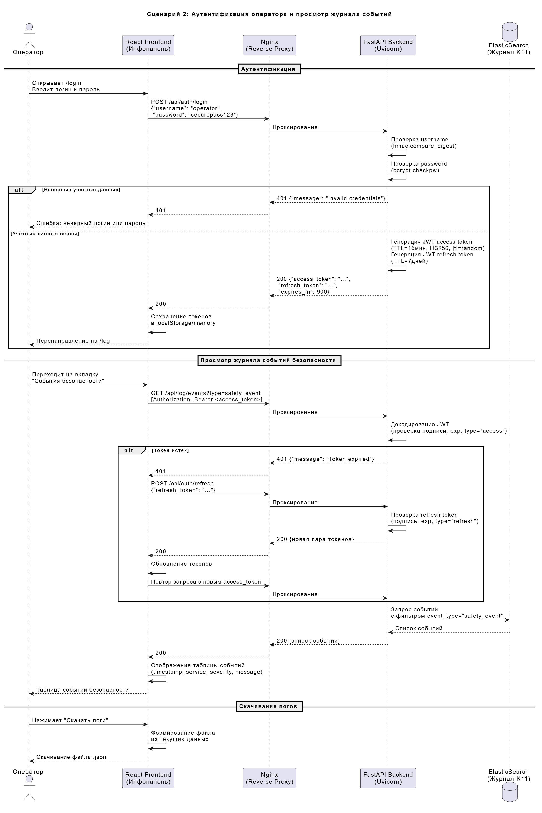
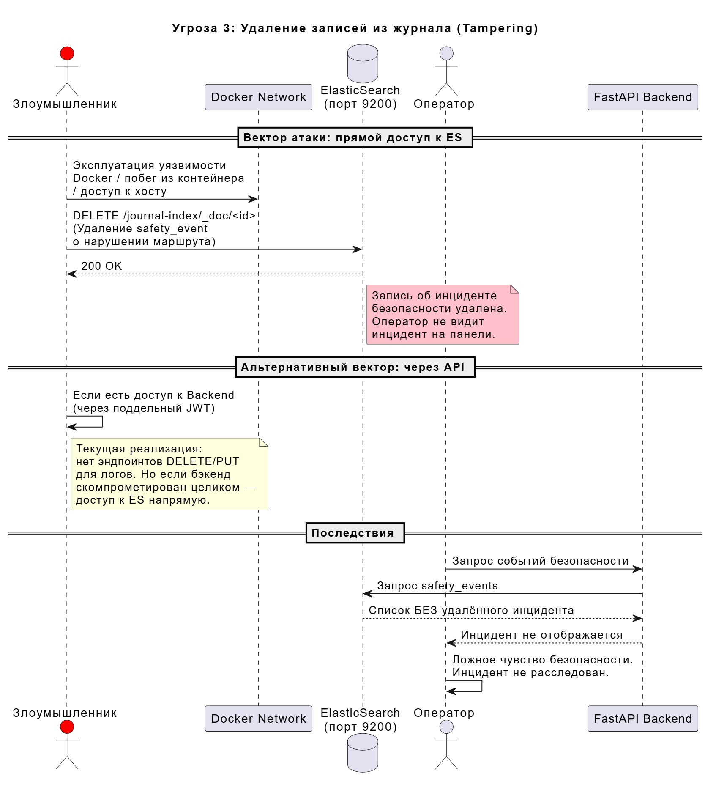
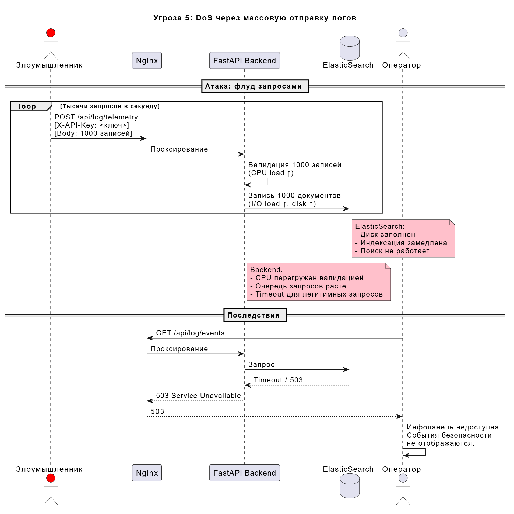

---

# Анализ безопасности системы DroneAnalytics (Инфопанель)

---

## Пункт 1. Ключевые активы, оценка уровня ущерба и приемлемость риска

### 1.1. Идентификация активов

Активы системы - это всё, что имеет ценность и что необходимо защищать. Для DroneAnalytics выделяем следующие:


| №   | Актив                                | Описание                                                                                                                                                                        | Категория      |
| --- | ------------------------------------ | ------------------------------------------------------------------------------------------------------------------------------------------------------------------------------- | -------------- |
| A1  | **Данные телеметрии дронов**         | Координаты (latitude, longitude), ориентация (pitch, roll, course), уровень заряда (battery), идентификаторы дронов. Поступают от внешних сервисов через `POST /log/telemetry`. | Данные         |
| A2  | **События и события безопасности**   | Логи от сервисов экосистемы: event_type (event / safety_event), severity (debug...emergency), сообщения. Поступают через `POST /log/event`.                                     | Данные         |
| A3  | **Базовые логи**                     | Простейшие записи (timestamp + message) через `POST /log/basic`.                                                                                                                | Данные         |
| A4  | **Журнал событий (K11)**             | Хранилище в ElasticSearch - агрегированные записи из A1, A2, A3. Является центральным хранилищем для расследования инцидентов.                                                  | Хранилище      |
| A5  | **Учётные данные пользователей**     | Логины, хеши паролей (bcrypt), JWT-секрет. В текущей реализации - один пользователь из переменных окружения.                                                                  | Секреты        |
| A6  | **API-ключи сервисов**               | Ключи для аутентификации внешних сервисов (X-API-Key). В текущей реализации - один ключ из env.                                                                               | Секреты        |
| A7  | **JWT-токены (access + refresh)**    | Выдаются при аутентификации. Access-токен (TTL 15 мин) для авторизации запросов, refresh-токен (TTL 7 дней) для обновления. Подписаны SECRET_KEY (HS256).                       | Секреты        |
| A8  | **Инфопанель (фронтенд)**            | React-приложение: визуализация логов, телеметрии, событий безопасности. Единственный интерфейс взаимодействия пользователя с данными.                                             | Сервис         |
| A9  | **Бэкенд (FastAPI)**                 | Серверная часть: валидация данных, аутентификация, маршрутизация, бизнес-логика.                                                                                                | Сервис         |
| A10 | **Конфигурация и секреты окружения** | Переменные окружения: DRONE_SECRET_KEY, DRONE_API_KEY, DRONE_AUTH_PASSWORD и т.д.                                                                                               | Секреты        |
| A11 | **Инфраструктура (Nginx, Docker)**   | Nginx как единственная точка входа и прокси. Docker-контейнеры обеспечивают изоляцию.                                                                                           | Инфраструктура |


### 1.2. Оценка уровня ущерба

Оцениваем ущерб по трём классическим свойствам информационной безопасности (CIA: Confidentiality, Integrity, Availability) по шкале:

- **Низкий** - незначительные последствия, легко восстановимы
- **Средний** - заметные последствия, требуется время на восстановление
- **Высокий** - серьёзные последствия, возможен ущерб для экосистемы дронов
- **Критический** - катастрофические последствия, угроза безопасности полётов


| Актив                   | Конфиденц.      | Целостность     | Доступность     | Обоснование                                                                                                                                                     |
| ----------------------- | --------------- | --------------- | --------------- | --------------------------------------------------------------------------------------------------------------------------------------------------------------- |
| A1 Телеметрия           | **Критический**         | Средний | Средний         | Подмена координат искажает журнал и мешает расследованию. Потеря данных мешает расследованию инцидентов. Перехват координат даёт возможность атаки (неопределённость координат для анализа). |
| A2 События безопасности | **Критический**         | Средний | Средний | Safety_event - это сигналы о нарушении целей безопасности. Подмена или удаление этих данных скрывает инциденты. Недоступность мешает оперативному реагированию. |
| A3 Базовые логи         | Средний          | Низкий         | Низкий         | Общие логи менее критичны, но их целостность важна для аудита.                                                                                                  |
| A4 Журнал (K11)         | Высокий         | Средний | Средний         | Журнал - основной источник для расследования инцидентов. Его подмена или удаление делает невозможным установление причин сбоев.                                 |
| A5 Учётные данные       | **Критический** | **Критический** | Высокий         | Компрометация credentials даёт полный доступ к системе.                                                                                                         |
| A6 API-ключи            | **Критический** | **Критический** | Высокий         | Утечка API-ключа позволяет отправлять произвольные данные от имени легитимного сервиса.                                                                         |
| A7 JWT-токены           | **Критический**         | **Критический** | Средний         | Перехват токена = сессия атакующего. Подмена SECRET_KEY = произвольные токены.                                                                                  |
| A8 Инфопанель           | Низкий          | Средний         | Средний         | XSS может привести к краже токенов. Недоступность лишает операторов информации.                                                                                 |
| A9 Бэкенд               | Средний         | Срдени | Средний | Компрометация бэкенда = полный контроль над данными.                                                                                                            |
| A10 Конфигурация        | **Критический** | **Критический** | Высокий         | Секреты окружения - корень доверия. Их компрометация = компрометация всего.                                                                                     |
| A11 Инфраструктура      | Средний         | Высокий         | **Критический** | Обход Nginx / побег из Docker = прямой доступ к внутренним сервисам.                                                                                            |


### 1.3. Приемлемость риска


| Актив                   | Приемлемость риска                           | Пояснение                                                                                     |
| ----------------------- | -------------------------------------------- | --------------------------------------------------------------------------------------------- |
| A1 Телеметрия           | Условно приемлем               | Потеря части логов не критична, но нежелательна. |
| A2 События безопасности | Условно приемлем | Потеря части логов не критична, но нежелательна. |
| A3 Базовые логи         | Условно приемлем                             | Потеря части логов не критична, но нежелательна.                                              |
| A4 Журнал (K11)         | Условно неприемлем               | Журнал неприкосновенен - это основа для аудита и расследования.                               |
| A5 Учётные данные       | **Неприемлем**                               | Компрометация = полный доступ.                                                                |
| A6 API-ключи            | **Неприемлем**                               | Компрометация = инъекция ложных данных.                                                       |
| A7 JWT-токены           | **Неприемлем**                               | Компрометация SECRET_KEY = генерация произвольных токенов.                                    |
| A8–A11                  | По ситуации                                  | Инфраструктурные риски управляемы через стандартные практики (обновления, мониторинг).        |


**Вывод по п. 1:** Наиболее критичные активы, требующие приоритетной защиты:

1. **Журнал событий (K11)** - конфиденциальность
2. **Учётные данные и секреты** - конфиденциальность и целостность

---

## Пункт 2. Роли пользователей и ключевые сценарии использования

### 2.1. Роли пользователей


| Роль                                   | Описание                                                                                                                                | Аутентификация                             | Права                                                                                                                          |
| -------------------------------------- | --------------------------------------------------------------------------------------------------------------------------------------- | ------------------------------------------ | ------------------------------------------------------------------------------------------------------------------------------ |
| **Оператор (Администратор)**           | Авторизованный пользователь инфопанели. Просматривает дашборд, фильтрует логи, скачивает отчёты.      | JWT (login + password) через `/auth/login` | Полный доступ к инфопанели: просмотр телеметрии, событий, журнала. Скачивание логов.                       |
| **Внешний сервис**                     | Автоматизированный компонент экосистемы (дрон, GCS, агрегатор, страховая, регулятор и т.д.). Отправляет телеметрию и события в систему. | API Key (заголовок `X-API-Key`)            | Только запись: отправка телеметрии (`/log/telemetry`), базовых логов (`/log/basic`), событий (`/log/event`). Чтение запрещено. |
| **Неаутентифицированный пользователь** | Любой, кто не прошёл аутентификацию.                                                                                                    | Нет                                        | Доступ только к `POST /auth/login` и `POST /auth/refresh`. Все остальные эндпоинты закрыты.                                    |


**Почему именно такие роли:**

- Оператор - это человек, который следит за экосистемой через дашборд. Ему нужен полный обзор происходящего.
- Внешний сервис - это машина. Она не должна видеть данные других сервисов, только отправлять свои. Принцип минимальных привилегий.
- Разделение на JWT (для людей) и API Key (для сервисов) - стандартная практика: JWT поддерживает сессии и обновление, а API Key проще для M2M (machine-to-machine) взаимодействия.

### 2.2. Сценарий 1: Внешний сервис отправляет телеметрию и события

**Контекст:** Дрон типа «delivery» (или его наземная станция управления - GCS) периодически отправляет телеметрию о своём местоположении. При возникновении инцидента (например, отклонение от маршрута) GCS генерирует safety_event.


### 2.3. Сценарий 2: Оператор входит в систему и просматривает журнал

**Контекст:** Оператор (администратор инфопанели) открывает веб-интерфейс, проходит аутентификацию, просматривает журнал событий безопасности и скачивает логи для анализа.

**Пояснение к сценариям:**

- В сценарии 1 показан полный жизненный цикл данных от внешнего сервиса: аутентификация → валидация → сохранение. Важно, что API Key проверяется до валидации данных (fail fast).
- В сценарии 2 показан пользовательский путь с учётом механизма обновления токенов. Это важно, т.к. access token имеет короткий TTL (15 мин) для минимизации окна уязвимости.

---

## Пункт 3. Функциональная архитектура системы

### 3.1. Общая схема

Система DroneAnalytics (Инфопанель) состоит из следующих функциональных компонентов:


### 3.2. Функциональные модули и их назначение


| Компонент               | Функция                                                       | Входные данные                                         | Выходные данные                                     |
| ----------------------- | ------------------------------------------------------------- | ------------------------------------------------------ | --------------------------------------------------- |
| **Nginx**               | Reverse proxy, TLS termination, отдача статики, маршрутизация | HTTP(S) запросы от клиентов                            | Проксированные запросы к бэкенду; статика фронтенда |
| **FastAPI Backend**     | Бизнес-логика, аутентификация, валидация, API                 | REST запросы                                           | JSON-ответы, JWT-токены                             |
| **ElasticSearch**       | Хранение и полнотекстовый поиск по журналу событий            | Документы (телеметрия, события)                        | Результаты поиска, агрегации                        |                     
| **React Frontend**      | Визуализация данных, пользовательский интерфейс               | JSON от API                                            | Веб-страницы с таблицами, фильтрами, графиками      |


### 3.3. Потоки данных

**Поток 1: Данные от внешних сервисов → Журнал**

```
Внешний сервис → [X-API-Key] → Nginx → Backend (валидация) → ElasticSearch
```

**Поток 2: Оператор → Просмотр журнала**

```
Оператор → Frontend → [JWT] → Nginx → Backend → ElasticSearch → Backend → Frontend → Оператор
```

**Почему такая архитектура:**

- **Nginx как единственная точка входа** - реализует принцип «минимальная поверхность атаки». Бэкенд и БД не доступны напрямую из внешней сети.
- **Разделение аутентификации** (JWT для людей, API Key для машин) - разные модели угроз: у людей есть сессии, у машин нет.

---

## Пункт 4. Цели и предположения безопасности

### 4.1. Цели безопасности

Цели безопасности формулируются на основе наиболее критичных активов (п. 1) и направлены на защиту их ключевых свойств.


| ID       | Цель безопасности                                                                                                                                                                                                              | Защищаемые активы                                                 | Свойство                   | Приоритет   |
| -------- | ------------------------------------------------------------------------------------------------------------------------------------------------------------------------------------------------------------------------------ | ----------------------------------------------------------------- | -------------------------- | ----------- |
| **ЦБ-1** | **Конфиденциальность инфопанели** | A5 (Учетные данные), A7 (JWT)      | Конфиденциальность                | Критический |
| **ЦБ-2** | **Конфиденциальность журнала**| A5(Учетные данные), A6 (API-ключи)                     | Конфиденциальность | Критический |
| **ЦБ-3** | **Изоляция журнала** Доступ к elastic имеют только backend и его init контейнер | А4( Журнал событий) | Конфиденциальность и целостность        | Высокий |

### 4.2. Предположения безопасности

Предположения - это условия, которые система считает истинными и не проверяет самостоятельно. Если какое-то предположение нарушается - модель безопасности рушится.


| ID       | Предположение                                                                                                                                                                                                        | Обоснование                                                                                                                    |
| -------- | -------------------------------------------------------------------------------------------------------------------------------------------------------------------------------------------------------------------- | ------------------------------------------------------------------------------------------------------------------------------ |
| **ПБ-1** | **Nginx корректно сконфигурирован** и является единственной точкой входа в систему. Прямой доступ к бэкенду и БД из внешней сети невозможен.                                                                         | Nginx - единственный контейнер с открытым портом (80/443). Docker network изолирует внутренние сервисы.                        |
| **ПБ-2** | **Docker-контейнеры обеспечивают изоляцию** процессов. Побег из контейнера невозможен в рамках данной модели.                                                                                                        | Контейнеризация - базовый принцип архитектуры (из ТЗ).                                                                         |
| **ПБ-3** | **TLS-сертификаты выдаются и подписываются Регулятором.** Канал между внешними сервисами и Nginx защищён TLS. MITM-атака на этом уровне невозможна.                                                                  | Прямо указано в ТЗ: «Сертификаты будут выдаваться и подписываться Регулятором».                                                |
| **ПБ-4** | **Операционная система хоста и Docker-runtime являются доверенными.** Они корректно работают и не скомпрометированы.                                                                                                 | Стандартное предположение. Защита ОС - вне скоупа нашей системы.                                                               |
| **ПБ-5** | **Секреты окружения (env variables) защищены на уровне хоста.** Переменные DRONE_SECRET_KEY, DRONE_API_KEY и т.д. недоступны неавторизованным субъектам.                                                             | Управление секретами - ответственность DevOps.                                       |
| **ПБ-6** | **Алгоритмы bcrypt и HS256 (HMAC-SHA256) криптографически стойки** на момент эксплуатации системы.                                                                                                                   | Общепринятое предположение. bcrypt с rounds=12 считается безопасным.                                                           |
| **ПБ-7** | **Внешние сервисы экосистемы не скомпрометированы** (в плане их легитимности). Если сервис имеет валидный API-ключ - он является тем, за кого себя выдаёт. Компрометация ключа рассматривается как отдельная угроза. | Мы не можем верифицировать «содержимое» данных (является ли телеметрия реальной), мы проверяем только аутентичность источника. |
| **ПБ-8** | **Оператор является доверенным субъектом.** После успешной аутентификации оператор не является злоумышленником.                                                                                                      | У нас одна роль пользователя. Инсайдерские угрозы минимизируются журналированием.                                              |


**Почему именно такие цели и предположения:**

- Цели напрямую следуют из анализа активов (п. 1): мы защищаем то, что имеет наибольшую ценность и наименее приемлемый риск.
- Предположения определяют границы модели: всё, что «ниже» (ОС, сеть, крипто) - принимается на веру. Всё, что «внутри» (наш код, наша конфигурация) - мы контролируем.
- ЦБ-1 (целостность журнала) - самая важная цель, т.к. журнал - основа для расследования инцидентов во всей экосистеме дронов.

---

## Пункт 5. Моделирование угроз

### 5.1. Угроза 1: Подмена телеметрии

**Описание:** Злоумышленник перехватывает или подбирает API-ключ и отправляет поддельную телеметрию от имени легитимного сервиса. Ложные координаты дрона отображаются на инфопанели.

**Нарушаемые цели:** ЦБ-2


**Оценка критичности:** ВЫСОКАЯ. Ложная телеметрия искажает журнал, мешает расследованию инцидентов и может скрыть реальные координаты (даёт возможность атаки при неопределённости данных).

**Контрмеры:**

- Ротация API-ключей
- Привязка API-ключа к конкретному сервису (per-service keys)
- Мониторинг аномалий в телеметрии (резкие перемещения, невозможные координаты)
- Логирование всех запросов с метаданными (IP, timestamp)

---

### 5.2. Угроза 2: Компрометация JWT-секрета

**Описание:** Злоумышленник получает SECRET_KEY (через утечку env, доступ к контейнеру, etc.) и генерирует произвольные JWT-токены, получая полный доступ к инфопанели.

**Нарушаемые цели:** ЦБ-1


**Оценка критичности:** КРИТИЧЕСКАЯ. Компрометация SECRET_KEY = полный доступ без ограничений по времени (можно генерировать токены с любым TTL).

**Контрмеры:**

- Хранение SECRET_KEY в vault (HashiCorp Vault, Docker Secrets)
- Генерация SECRET_KEY при старте, если не задан явно
- Мониторинг аномальных сессий (множество jti от одного sub)
- Ротация SECRET_KEY (инвалидирует все существующие токены)

---

### 5.3. Угроза 3: Удаление или модификация журнала

**Описание:** Злоумышленник получает прямой доступ к ElasticSearch и удаляет или модифицирует записи журнала, скрывая следы инцидентов.

**Нарушаемые цели:** ЦБ-3


**Оценка критичности:** КРИТИЧЕСКАЯ. Сокрытие инцидентов безопасности напрямую подрывает основную функцию системы.

**Контрмеры:**

- ElasticSearch доступен только из Docker network связанной с настоящей системой (нет проброса порта 9200 наружу)
- Append-only политика для индексов логов (ILM - Index Lifecycle Management)
- Хеширование записей (цепочка хешей для обнаружения удаления)
- Репликация журнала во внешнее хранилище
- Мониторинг количества записей (алерт при уменьшении)

---

### 5.4. Угроза 4: XSS-атака на инфопанель

**Описание:** Злоумышленник внедряет вредоносный JavaScript через поле `message` в событии. Когда оператор открывает журнал, скрипт исполняется в его браузере и крадёт JWT-токен.

**Нарушаемые цели:** ЦБ-1


**Оценка критичности:** СРЕДНЯЯ (React по умолчанию экранирует HTML), но ВЫСОКАЯ если есть хоть одно место с `dangerouslySetInnerHTML` или `innerHTML`.

**Контрмеры:**

- React по умолчанию экранирует JSX - не использовать `dangerouslySetInnerHTML`
- Content-Security-Policy (CSP) заголовки в Nginx
- Санитизация message на бэкенде (удаление HTML-тегов)
- Хранение токенов в httpOnly cookies вместо localStorage

---

### 5.5. Угроза 5: DoS-атака через массовую отправку логов

**Описание:** Злоумышленник отправляет огромное количество запросов к `/log/`*, перегружая бэкенд и ElasticSearch.

**Нарушаемые цели:** ЦБ-3


**Оценка критичности:** Средняя. Недоступность инфопанели во время реального инцидента критична.

**Контрмеры:**

- Rate limiting в Nginx (limit_req_zone)
- Ограничение размера body (max 1000 записей - уже реализовано в Pydantic: `max_length=1000`)
- Квоты на запись по API-ключу
- Мониторинг нагрузки и автоскейлинг
- Разделение индексов ES: критические (safety_event) отдельно от телеметрии

---

## Пункт 6. Диаграмма архитектуры политики информационной безопасности

### 6.2. Диаграмма архитектуры политики ИБ


### 6.3. Политики безопасности (Policy Enforcement)


| Точка проверки                           | Политика                                                                | Реализация                                                                       |
| ---------------------------------------- | ----------------------------------------------------------------------- | -------------------------------------------------------------------------------- |
| **Nginx → Backend**                      | Только разрешённые маршруты (/api/*) проксируются                       | Конфигурация Nginx (location)                                                    |
| **Backend: вход в /log/***               | Запрос должен содержать валидный API-ключ                               | `require_api_key()` - hmac.compare_digest                                        |
| **Backend: вход в защищённые эндпоинты** | Запрос должен содержать валидный JWT access token                       | `require_bearer_payload()` - jwt.decode + проверка type, sub, exp                |
| **Backend: данные от сервисов**          | Данные должны соответствовать схеме (типы дронов, координаты, severity) | Pydantic: `StrictModel(extra="forbid")`, `Field(ge=..., le=...)`, `Literal[...]` |
| **ElasticSearch: запись**                | Только через Backend (нет прямого внешнего доступа)                     | Docker network isolation                                                         |

---
## Пункт 7. Декомпозиция архитектуры и минимизация доверенных доменов безопасности
### 7.1 Текущее состояние
Можно посмотреть в отдельном файле [ARCHITECTURE.md](./ARCHITECTURE.md)
---